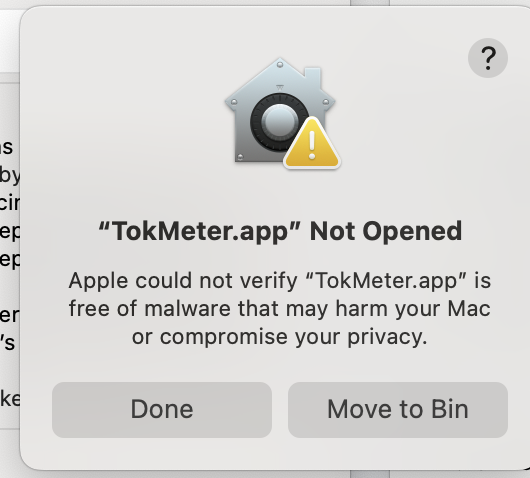

# TokMeter

An always-on minimal macOS menu bar app that tracks real-time API spend broken down by AI provider and model and type (cost, tokens, input, output, cache, etc.). Keep an eye on your daily spend across models from Anthropic and OpenAI.

Know the cost impact of your last run or your last question to your OpenClaw bot. Which model did what and how much it cost? Did it hit the cache or not? All that in a simple tiny bar on top of your screen.


## Why

If you're running OpenClaw and other AI-powered tools — coding assistants, agents, orchestration pipelines — you're burning through API tokens across Claude and OpenAI with no visibility into what it's costing you while you work. The only way to check is to stop what you're doing, log into each provider's dashboard, and look at graphs that update with a delay.

TokMeter puts your API and OpenClaw spend right in the menu bar. You see it every time you glance at your screen. Per-model breakdown, token counts, cost of the last action — always current, always visible.

I built this because I run multiple AI models in parallel through [OpenClaw](https://openclaw.com) and other AI tools and needed to know in real time what the pipeline was consuming. The alternative was stopping everything to switch to OpenAI and Anthropic dashboards, or surprise invoices at the end of the month.

Now I just glance at the top of my screen and know exactly my spend.

**[Download TokMeter](https://github.com/Jbsorge/TokMeter-app/releases/latest)** — or install with `brew tap jbsorge/tokmeter && brew install --cask tokmeter`

## What it shows

**Menu bar:** `C:$1.23 | O:$0.45 = $1.68` — today's combined spend at a glance.

**Dropdown menu:**
- Per-model cost breakdown (Opus, Sonnet, Haiku, GPT-4o, etc.)
- Input / output / cache costs per model
- Token counts
- "Latest" — cost of the most recent API activity since last refresh
- Today and month-to-date totals per provider
- Export current data to Markdown

Auto-refreshes every 2 minutes.

## Install

### Option A — Homebrew (one command)

```bash
brew tap jbsorge/tokmeter && brew install --cask tokmeter
```

Homebrew downloads, verifies, and installs TokMeter.app for you. Launch it from Applications.

### Option B — Direct download

1. Go to the [Releases page](https://github.com/Jbsorge/TokMeter-app/releases/latest)
2. Download **TokMeter-mac-arm64.zip**
3. Unzip it
4. Drag **TokMeter.app** to your Applications folder
5. Double-click to launch

**Requires:** macOS on Apple Silicon (M1/M2/M3/M4).

### macOS security prompt

macOS blocks apps from independent developers on first launch. You'll see this popup:



This is standard for all Mac apps that aren't distributed through the App Store. To open it:

1. Click **Done** to dismiss the popup
2. Open **System Settings → Privacy & Security**
3. Scroll down — you'll see "TokMeter.app was blocked"
4. Click **Open Anyway**
5. Confirm when prompted

You only need to do this once. After that, TokMeter opens normally every time.

### API keys

You need Admin API keys (not regular API keys):
- **Anthropic**: `sk-ant-admin-...` — get one at [console.anthropic.com](https://console.anthropic.com) → Settings → Admin API Keys
- **OpenAI**: `sk-admin-...` — get one at [platform.openai.com/settings/organization/admin-keys](https://platform.openai.com/settings/organization/admin-keys)

Enter each key once and you're done — TokMeter saves them locally and uses them across all your projects, tools, and sessions. No re-entering keys, no per-project setup, no recurring prompts. Your keys stay on your machine at `~/.usage-monitor/config.json` and work until you revoke them.

## How it works

- **Anthropic (Claude):** Anthropic's cost API only reports completed days — you can't get today's cost until tomorrow. So TokMeter fetches real-time token counts from the usage report API and computes cost locally using Anthropic's published per-model pricing. Covers input, output, and cache tokens.
- **OpenAI:** Fetches actual dollar costs from the costs API with per-model breakdown.

## Privacy

TokMeter does not read your browser cookies, local storage, Keychain, or any files on your disk. It does not request Full Disk Access, Screen Recording, Accessibility, or any other macOS permission. It makes HTTPS calls to two endpoints — `api.anthropic.com` and `api.openai.com` — using the API keys you provide, and nothing else. Your keys are stored locally in `~/.usage-monitor/config.json` and never leave your machine except to authenticate with those two APIs.

## Design

Lightweight native macOS menu bar app. No Keychain, no cookies, no macOS permissions beyond network. Authenticates directly with provider Admin APIs using keys you control. Nothing is sent anywhere except the official Anthropic and OpenAI endpoints.

## License

MIT — see [LICENSE](LICENSE).

## Author

JB Sorge
